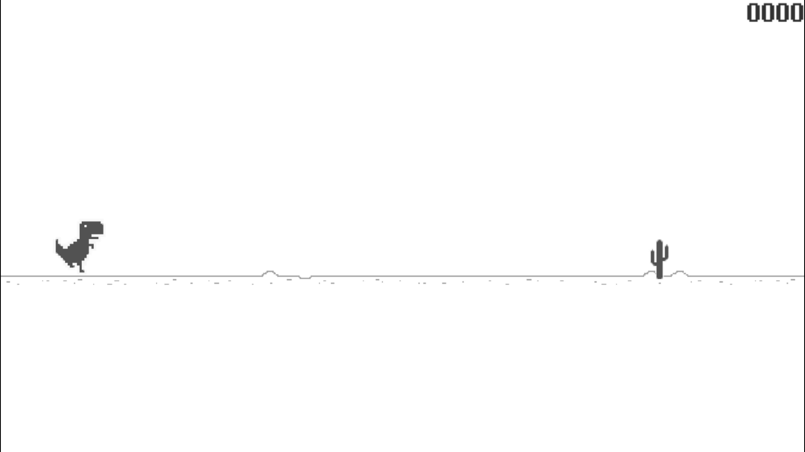

# Dinosaur-Game
* Clon del juego del dinosaurio de Google Chrome

---

# Descargar Unity, ejecutar el proyecto y utilizar Visual Studio

## Descargar Unity
* Dirigirnos al [sitio oficial de descarga](https://unity.com/download) de Unity y descargar el hub como cualquier otra aplicacion simplemente tocando siguiente, siguiente, siguiente
* Una vez instalado, nos dirigimos  a la parte de `Installs`, luego en `ADD` e instalamos la version de Unity utilizada en este proyecto que es la `2020.3.28f1`
* Lo siguiente es seleccionar los modulos. El unico que vamos a seleccionar es el que dice `Microsoft Visual Studio Community` seguido de un año que puede ir cambiando
* Esperamos a que se instale y ya estaria

---

## Ejecutar el proyecto
* Nos dirigimos a la parte de `Installs`, luego en `OPEN` y abrimos la carpeta del proyecto la cual deberia de tener una carpeta con el nombre del proyecto, por ejemplo `John And Grunt` y otra con el nombre `My project`
* Con esto, ya tendremos el proyecto importado

---

## Utilizar Visual Studio
* Con todos los pasos anteriores ya se puede ejecutar y probar el proyecto, no obstante, no podemos realizar cambio en ningun script ya que Unity no tiene ningun IDE o editor de texto incluido
* Entonces, descargamos [Visual Studio](https://visualstudio.microsoft.com/es/downloads/) como cualquier otra aplicacion simplemente tocando siguiente, siguiente, siguiente
* Lo siguiente es seleccionar los modulos. Los modulos que vamos a seleccionar son: `.NET desktop development`  y `Game development with Unity`
* Vamos a algun proyecto de Unity, tocamos en `Edit` -> `Preferences` -> `External Tools` -> `External Script Editor` y seleccionamos `Microsoft Visual Studio Community` seguido de un año que puede ir cambiando
* Ahora, podremos modificar los scripts de Unity que son escritos en C#